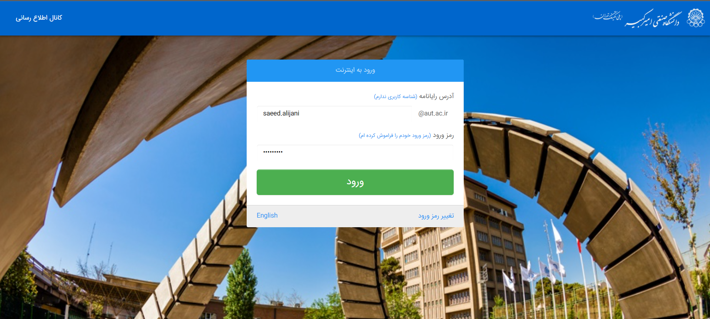
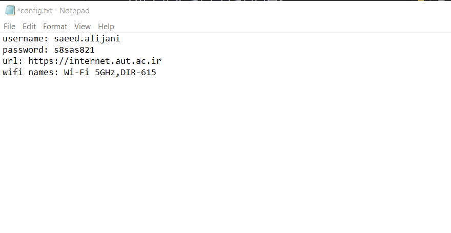
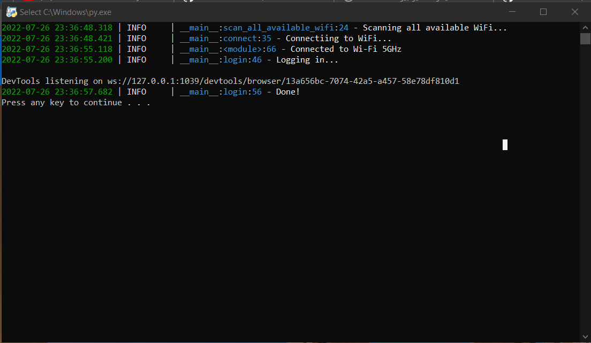

# Auto Connect WiFi


  <p align="center">
  
</p>

- [Introduction](#introduction)
- [Steps to setup code to work as it should](#steps-to-setup-code-to-work-as-it-should)
  * [Step1 : Install python and required modules](#step1---install-python-and-required-modules)
  * [Step 2 : Move all files from `src` folder to any folder you like.](#step-2---move-all-files-from--src--folder-to-any-folder-you-like)
  * [Step 3 : Make a text file and copy commands below in it and finally save it with the name `run.bat` :](#step-3---make-a-text-file-and-copy-commands-below-in-it-and-finally-save-it-with-the-name--runbat---)
  * [Step 4 : Make shortcut of `run.bat` file and and put it in `startup` directory :](#step-4---make-shortcut-of--runbat--file-and-and-put-it-in--startup--directory--)
  * [Step 5 : Set config.txt](#step-5---set-configtxt)
- [Running](#running)


# Introduction
<div style="text-align: justify"> This code has been written for logging automatically in the AmirKabir University's internet site. Each time when you turn on your PC or laptop, you have to connect to the university's router, then you have to open your browser and go to https://internet.aut.ac.ir and fill in your username and password on this webpage as below, after logging in you will have access to the internet with your system. </div>
  <p align="center">
  
</p>

<div style="text-align: justify">I was wondering if I could write a code that logs in automatically with each startup in windows os, this code will do the trick. ( it's easy to change to code for another login page; you need to replace username, password, and Enter elements with your website's elements by using inspect in the browser; if you have any problems email me 😉). The code will automatically try connecting to the wifi names list that you set in the config.txt file and after that, it will log in with the username and password you have put in the config.txt file. If no known WiFis are available, it will get you an error message that no wifi is available.</div>

# Steps to setup code to work as it should
## Step1 : Install python and required modules


First, install python and then use this command to install all required modules for the requirements.txt file with the code as below in cmd:
```
pip install -r requirements.txt
```
## Step 2 : Move all files from `src` folder to any folder you like.
## Step 3 : Make a text file and copy commands below in it and finally save it with the name `run.bat`
```bat
@echo off 
python "{full path of your main.py file in your pc or laptop}"
```
## Step 4 : Make shortcut of `run.bat` file and and put it in `startup` directory
you have to find the startup folder, press `Windows + R` and then write `shell:startup` and press OK and copy `run.bat` shortcut to the opened window.

## Step 5 : Set config.txt

You have to set your username, password, url, wifi names in `config.txt` as below.: (remember that there is always a space after each `:` and wifi names are your default wifi's SSIDs)
 <p align="center">
  
</p>

# Running 
If you do all steps correctly, when you turn on your laptop or pc, this window will show up:
 <p align="center">
  
</p>
